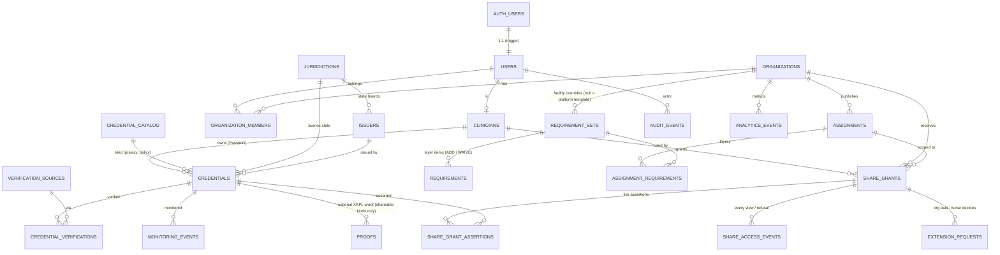

# Veridun backend groundwork (handoff §43–45)

**Status:** groundwork only. **No live service is connected**: no Supabase project or account exists, and no credentials are used anywhere. The live demo still runs entirely in the browser. This PR adds:

| Path | What it is |
|---|---|
| `backend/supabase/migrations/*.sql` | Postgres schema, row-level security (RLS), share-access functions, private storage bucket + policies |
| `backend/supabase/seed/01_reference.sql` | Jurisdictions (56), issuers, the RN credential catalog (36 kinds), verification sources, platform requirement templates. **Generated from `js/`** |
| `backend/supabase/seed/02_demo.sql` | Demo data (Alex / Jordan / Sam, 4 fictional agencies, 5 opportunities). Dev/staging only |
| `backend/scripts/generate-seed.js` | Regenerates both seed files from the app's JS data, so the database can't drift from the demo |
| `backend/supabase/tests/00_local_supabase_shim.sql` | **Test-only** stand-ins for Supabase's `auth`/`storage` schemas and API roles. Never apply to a real project |
| `backend/tests/db-test.js` | Applies migrations + seeds to a throwaway local Postgres; 75 schema / seed / RLS tests |
| `backend/tests/store-test.js` | 24 unit tests for the data-access layer (mocked network) |
| `js/config.js`, `js/store.js` | Data-access layer: `LocalStorageAdapter` (default, today's behavior) and a `SupabaseAdapter` stub |

## Architecture

```
Browser (GitHub Pages, static)                     Supabase (future)
┌───────────────────────────────┐                  ┌───────────────────────────────────────┐
│ views (clinician/org/verifier)│                  │ Auth (email magic link)               │
│        │ sync API             │                  │ PostgREST  /rest/v1  (anon key + JWT) │
│        ▼                      │   HTTPS, user    │   └─ RLS on every table               │
│ js/store.js                   │   JWT + anon key │ RPCs: get_share_assertions,           │
│  ├─ LocalStorageAdapter (now) │ ───────────────▶ │       access_share_by_token,          │
│  └─ SupabaseAdapter (stub):   │                  │       revoke_share_grant,             │
│     local cache + write-behind│                  │       resolve_extension_request       │
│     outbox, RPC helpers       │                  │ Storage: private "source-documents"   │
└───────────────────────────────┘                  │ pg_cron: private.sweep_expired_grants │
                                                   └───────────────────────────────────────┘
```

- **The app API stays synchronous.** Views call `store.credentials.load()/save()`, `store.events.append()`, `store.shares.*`, `store.shareRequests.*`, `store.customAssignments.*`, `store.meta.*`, `store.session.*`. No module touches `localStorage` directly any more (enforced by `store-test.js`).
- **`LocalStorageAdapter`** is the default and uses the same keys as before, so existing demo data still loads.
- **`SupabaseAdapter`** is selected only when `js/config.js` sets `backend: 'supabase'` with a valid project URL and **anon/publishable** key. It keeps the same local cache, so the UI behaves exactly the same. It queues writes in an outbox and has REST/RPC helpers that send `apikey: <anon>` + `Authorization: Bearer <user JWT>`. It sends **nothing** until a user session exists. Sign-in and the actual sync are the next PR.
- **No service keys in the browser.** `validateSupabaseConfig()` rejects `service_role` JWTs, `sb_secret_…` keys and any config field carrying a service key, and falls back to browser-only storage with a visible note in Menu → Data storage.

## Entity diagram



Requirement layers map one-to-one to the browser engine: **STATE** (one RN-authorization requirement per jurisdiction) + **WORK_TYPE** base + **SPECIALTY** module (the one matching the nurse's profile specialty, if the assignment accepts it) + **FACILITY** overrides (`ADD` / `WAIVE`) + dates (`assignments.starts_on/ends_on`) + recency (`requirements.recency_months`). `db-test.js` checks that the seeded layers give the same counts as the browser engine: Boston ICU 12, Houston 11, Oakland 10 / 12 / 11 (ICU / ED / L&D), Phoenix ED 13, Denver L&D 12.

## Security model

| Who | Can | Cannot |
|---|---|---|
| **anon** (no sign-in) | read reference data (catalog, jurisdictions, issuers, verification sources) | read any person, credential, grant or event |
| **Clinician** | read/write own clinician row, credentials, share grants + assertions; upload into own storage folder; resolve extension requests on own grants; revoke | change verification status (`VERIFIED`, `REJECTED`, …); edit verified facts (expiry, kind, jurisdiction); start a credential as verified; touch another nurse's data; change own role; re-target or reactivate a revoked grant; share documents (`documents_shared` is constrained to `false`) |
| **Organization member** | read grant *metadata* for grants to **its own org** (incl. `REVOKED` + timestamp, `EXPIRED`); read **assertions only while the grant is live** (ACTIVE, unexpired, unrevoked, one-time not used); request extensions; publish its own assignments / facility override sets | read the `credentials` table; read another org's grants, assertions, members or events; extend its own access; create grants; read source documents |
| **Verifier** (`users.role = 'verifier'`) | read all credentials; update verification state; record verifications and monitoring events; read source documents for manual review | — (roles are assigned server-side only) |
| **Admin** | maintain reference data, organizations | — |

- **The live-grant rule is defined once** (`private.grant_is_live`). It is used both by the RLS policy on `share_grant_assertions` and by `get_share_assertions()`, so expired grants return nothing even before the sweep job has run.
- **No sensitive health detail in assertions:**
  - PRIVATE catalog kinds (health, screening, specialty references) can only be shared as `REQUIREMENT_SATISFIED` (trigger).
  - `get_share_assertions()` returns only a label and "Requirement Satisfied" for them: no name, dates, issuer, results or documents.
  - PRIVATE credentials can't store structured `metadata` (trigger) and can never get an on-chain proof (trigger).
- **Append-only:** `audit_events`, `share_access_events`, `monitoring_events` and `analytics_events` reject `UPDATE`/`DELETE` by trigger, even for the table owner. Clients can't insert `share_access_events` directly; they are written by `get_share_assertions()`, for every view and every refusal.
- **Source documents** go in the private bucket `source-documents`, under the path `<auth.uid()>/<credential-id>/<file>` (10 MB; PDF/PNG/JPEG/DOC/DOCX).
  - Owner: read/write own folder. Verifiers: read only. Organizations: no access.
  - Downloads use short-lived signed URLs created with the user's JWT: `createSignedUrl(path, 60)`.
  - Rows store only the object path.
- **Share tokens:** only `sha256(token)` is stored. Opening a link requires signing in as a member of the grant's org.

## Running the database tests locally (no Docker, no root)

```bash
# 1. Postgres 17 binaries from npm (any Postgres 15+ works)
mkdir -p /tmp/pgx && cd /tmp/pgx && echo '{}' > package.json
npm i @embedded-postgres/linux-x64@17.10.0-beta.17 pg
P=node_modules/@embedded-postgres/linux-x64/native/bin
node node_modules/@embedded-postgres/linux-x64/scripts/hydrate-symlinks.js; chmod +x $P/*
$P/initdb -D /tmp/pgdata -U postgres --auth=trust -E UTF8
$P/pg_ctl -D /tmp/pgdata -o "-p 54329 -k /tmp" -l /tmp/pg.log start
# 2. Tests (from the repo root)
PGHOST=/tmp PGPORT=54329 PGUSER=postgres NODE_PATH=/tmp/pgx/node_modules node backend/tests/db-test.js
node backend/tests/store-test.js
# Regenerate seeds after changing js/ catalog, requirement or demo data:
node backend/scripts/generate-seed.js
```

`db-test.js` creates and drops a database named `veridun_rls_test`. It loads the test shim, the 3 migrations and both seeds, and also checks that the seeds can be re-run.

## What Munib needs to do to go live

Nothing here was created on your behalf. When you're ready:

1. **Create a Supabase project** at supabase.com (US region; Postgres 15+ is the default). Note the **Project URL** and the **anon / publishable key** (Project Settings → API). Keep the `service_role` / secret key private: it never goes in this repo or the browser.
2. **Apply the schema:** run the three files in `backend/supabase/migrations/`, in order, in the SQL Editor. Alternatively, use the Supabase CLI: `cd backend && supabase init` (keep the existing `migrations/`), then `supabase link --project-ref <ref>` and `supabase db push`. Do **not** run `tests/00_local_supabase_shim.sql`.
   From a terminal, `psql -v ON_ERROR_STOP=1 --single-transaction -f <file>` per migration also works (connection string from Connect → Shared/Session pooler, kept in an env var, never committed). Status (Oct 8, 2026): migrations 1–3 and `01_reference.sql` are applied to Munib's staging project and verified (22 tables, RLS on all, private `source-documents` bucket). `02_demo.sql` was not applied.
3. **Load reference data:** run `backend/supabase/seed/01_reference.sql`. Run `02_demo.sql` only on a demo/staging project. It creates passwordless demo users in `auth.users`.
4. **Enable Auth:** turn on the Email provider (magic link). Set the Site URL to `https://munibabid.github.io/cleartrack-mvp/` and add it to the redirect URLs. Decide whether sign-ups are open or invite-only.
5. **Assign roles (server-side only)**, in the SQL Editor:
   `update public.users set role = 'verifier' where email = '…';`
   `insert into public.organization_members (org_id, user_id, role) values (…);`
6. **Schedule the expiry sweep:** enable `pg_cron`, then run
   `select cron.schedule('sweep-expired-grants', '*/15 * * * *', $$select private.sweep_expired_grants()$$);`
   This only updates status labels; access checks never depend on it.
7. **Send us the Project URL and anon key** (or put them in `js/config.js` as `backend: 'supabase'`). The anon key is designed to be public; RLS protects the data.
8. **Next PR (code, no action from you):**
   - Add Supabase Auth sign-in (`@supabase/supabase-js`, pinned + SRI).
   - Hydrate the store from the database.
   - Replace the stub outbox with real upserts and RPCs (revoke, extension, share access).
   - Upload source documents to the private bucket.
   - Move the role picker behind real sign-in.

## Cross-device sharing plan

Today a share only works in the browser that created it. With the backend:

1. **Create:** the nurse approves a share. The browser generates a random token, computes `sha256(token)`, and inserts the `share_grants` row plus its `share_grant_assertions` (RLS: own grants only; private kinds forced to `REQUIREMENT_SATISFIED`). The link is `…/cleartrack-mvp/?share=<token>`. The token exists only in the link.
2. **Open on another device:** the recruiter opens the link and signs in with a magic link. The app calls `rpc('access_share_by_token', { p_token })`. The function hashes the token, checks org membership and the live-grant rule, returns **live** sanitized assertions, logs `share_access_events` + `audit_events (SHARE_VIEWED)`, and consumes one-time grants.
3. **Revoke / expire:** `revoke_share_grant()` takes effect immediately for every device. The next call returns nothing and logs `REFUSED_REVOKED`. Expiry is checked on every read (`expires_at`). The org still sees status `REVOKED`/`EXPIRED` with timestamps through grant metadata.
4. **Extensions:** the org inserts an `extension_requests` row (`PENDING`). The nurse sees it on any device and calls `resolve_extension_request()`. Orgs can't update grants.
5. **Later (optional):** Supabase Realtime on `share_grants` / `extension_requests` for instant status updates, plus email notifications for requests and expirations.

## Known limits of this groundwork

- `SupabaseAdapter` is a stub: config validation, mapping, the outbox and REST/RPC helpers are tested with a mocked network. Hydration and sync are not implemented, and it has never talked to a real project.
- Tests run against plain Postgres 17 with a minimal shim of Supabase's `auth` and `storage` objects, not against Supabase itself. The policies use only standard Supabase primitives (`auth.uid()`, `storage.foldername()`, API roles), but should be smoke-tested once a project exists.
- Assignment readiness is still computed in the browser. A SQL/Edge Function version can follow once data lives in Postgres.
- Extension approval sets 23:59:59 **UTC** on the requested date. The browser demo uses the nurse's local end of day; the client can pass a local timestamp later.
