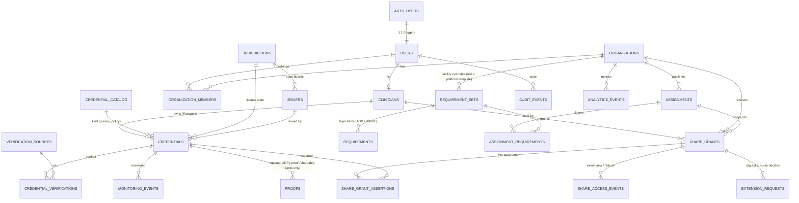

# Veridun backend (Supabase staging)

**Status (PR 10, Oct 8, 2026):** connected. The site has real email sign-in (Supabase Auth magic link). A signed-in clinician's profile, credentials, live shares, extension requests and access events are stored in Munib's **Supabase staging project** (`kiwbasfbiarscalzhopy`, US East), and organizations open shares through the database's share functions. The demo is unchanged and still browser-only.

> **Pre-compliance staging backend: no real PHI yet.** Supabase offers HIPAA support only on a paid plan with a signed BAA (plus their HIPAA project settings). This project has neither. Use test data only. The app shows this notice on the sign-in card and in the account workspace.

| Path | What it is |
|---|---|
| `backend/supabase/migrations/*.sql` | Postgres schema, row-level security (RLS), share-access functions, private storage bucket + policies. **4 migrations, all applied to staging** |
| `backend/supabase/migrations/20261008000004_accounts_sync.sql` | PR 10: self-serve organizations (`create_organization`), assignment context on grants, `PENDING_VERIFICATION` in share assertions, append-only tables that still allow account deletion |
| `backend/supabase/seed/01_reference.sql` | Jurisdictions (56), issuers, the RN credential catalog (36 kinds), verification sources, platform requirement templates. **Generated from `js/`.** Applied to staging |
| `backend/supabase/seed/02_demo.sql` | Demo data (Alex / Jordan / Sam, 4 fictional agencies, 5 opportunities). Local tests only, **not applied** to staging |
| `backend/scripts/generate-seed.js` | Regenerates both seed files from the app's JS data, so the database can't drift from the demo |
| `backend/supabase/tests/00_local_supabase_shim.sql` | **Test-only** stand-ins for Supabase's `auth`/`storage` schemas and API roles. Never apply to a real project |
| `backend/tests/db-test.js` | Applies migrations + seeds to a throwaway local Postgres; 92 schema / seed / RLS tests |
| `backend/tests/store-test.js` | 42 unit tests for the data-access layer (mocked supabase-js client, no network) |
| `js/config.js` | Demo: `backend: 'local'`. Accounts: project URL + **publishable** key (public by design; RLS protects data) + redirect URL |
| `js/store.js` | `LocalStorageAdapter` (demo) and `SupabaseAdapter` (accounts: auth, hydrate, writes, RPCs, storage) |
| `js/account.js` | Account UI: sign-in card, My Passport, Shares, Organization, Activity, `?share=` links for account shares |
| `js/vendor/supabase-js-2.117.2.umd.js` | `@supabase/supabase-js` 2.117.2 UMD build (MIT, `supabase-js-LICENSE`), loaded lazily with SRI `sha384-Rj26LVGv…` |

## Architecture

```
Browser (GitHub Pages, static)                          Supabase staging (kiwbasfbiarscalzhopy)
┌────────────────────────────────────┐                  ┌───────────────────────────────────────┐
│ demo views (clinician/org/verifier)│                  │ Auth: email magic link (implicit flow)│
│   └─ store.* ─▶ LocalStorageAdapter│  (never leaves   │ PostgREST /rest/v1 (publishable + JWT)│
│                 (this browser)     │   the browser)   │   └─ RLS on all 22 tables             │
│                                    │                  │ RPCs: create_organization,            │
│ js/account.js (YOUR ACCOUNT)       │   HTTPS,         │   access_share_by_token,              │
│   └─ store.account ─▶ SupabaseAdapter ──────────────▶ │   get_share_assertions,               │
│        in-memory cache only        │   user JWT +     │   revoke_share_grant,                 │
│        supabase-js (lazy, SRI)     │   publishable key│   resolve_extension_request           │
└────────────────────────────────────┘                  │ Storage: private "source-documents"   │
                                                        └───────────────────────────────────────┘
```

- **Two adapters, two kinds of data.** Demo views keep calling the synchronous `store.credentials/events/shares/…` API, backed by `LocalStorageAdapter` with the same keys as before. Account views call `store.account.*` (async) on `SupabaseAdapter`. Demo data is never uploaded, and account data never lands in `localStorage`.
- **Lazy loading.** `supabase-js` is loaded only when you click *Email me a sign-in link*, when a saved session exists (`sb-kiwbasfbiarscalzhopy-auth-token`), when the URL carries a magic-link callback, or when an account share link needs sign-in. The signed-out demo makes **zero** requests to Supabase (checked by `p8`/`p10`).
- **Sign-in:** `signInWithOtp({ email, options: { emailRedirectTo } })`. The redirect is `https://munibabid.github.io/cleartrack-mvp/` on the live site, or the current origin when run locally (Supabase falls back to the Site URL if that origin isn't allow-listed). Implicit flow is used so a link works even if the email app opens it in a different browser on the same phone. The session is stored by supabase-js, and it's the only account item kept in browser storage.
- **Hydrate:** after sign-in, the adapter loads the profile (`clinicians`), memberships, credentials, shares with assertions + org names, extension requests, access events and the activity log (`audit_events`) into memory. Mutations write first and then re-hydrate, so the UI always shows what the database accepted. **Refresh** reloads on demand. Another device picks up changes on sign-in or Refresh.
- **Writes** (all with the user's JWT, all checked by RLS and triggers):
  - credentials are inserted as `VERIFYING`. The database refuses anything else from a client (`credentials_status_guard`).
  - documents are uploaded to `source-documents/<auth.uid()>/<credential id>/<timestamp>-<safe file name>`. The row stores only the path. Viewing uses `createSignedUrl(path, 60)`. Deleting a credential deletes its object.
  - shares: the browser makes a random 128-bit token. It inserts `share_grants` with `token_hash = sha256(token)` plus `share_grant_assertions`. PRIVATE kinds are forced to `REQUIREMENT_SATISFIED`. The link (`…/?share=<token>`) and code are shown **once**.
  - revoke → `revoke_share_grant()`. Approve/decline → `resolve_extension_request()`. A clinician's own extend → `update share_grants` (owner policy). Reactivating a revoked or used grant is refused by trigger.
  - organizations: `create_organization(name)` (security definer). The caller becomes `owner`. Staging limit: 3 per account.
  - org extension request → `insert extension_requests` (`PENDING`). Orgs have no UPDATE on grants.
- **Opening a share (org):** the browser hashes the token, reads the grant's metadata through RLS (only grants to the caller's orgs are visible), then calls `access_share_by_token(token)`. That function checks membership and the live-grant rule, logs `share_access_events` + `audit_events`, consumes one-time grants, and returns sanitized assertions. A refusal comes back as *Revoked / Expired / Already viewed / Not found*.
- **No service keys in the browser.** `validateSupabaseConfig()` rejects `service_role` JWTs, `sb_secret_…` keys and any config carrying a service key. In that case accounts are disabled and the demo is unaffected.

## Entity diagram



Requirement layers map one-to-one to the browser engine: **STATE** (one RN-authorization requirement per jurisdiction) + **WORK_TYPE** base + **SPECIALTY** module (the one matching the nurse's profile specialty, if the assignment accepts it) + **FACILITY** overrides (`ADD` / `WAIVE`) + dates (`assignments.starts_on/ends_on`) + recency (`requirements.recency_months`). `db-test.js` checks that the seeded layers give the same counts as the browser engine: Boston ICU 12, Houston 11, Oakland 10 / 12 / 11 (ICU / ED / L&D), Phoenix ED 13, Denver L&D 12.

## Security model

| Who | Can | Cannot |
|---|---|---|
| **anon** (no sign-in, publishable key only) | read reference data (catalog, jurisdictions, issuers, verification sources) | read any person, credential, grant or event |
| **Clinician** | read/write own clinician row, credentials, share grants + assertions; upload into own storage folder; resolve extension requests on own grants; revoke | change verification status (`VERIFIED`, `REJECTED`, …); edit verified facts (expiry, kind, jurisdiction); start a credential as verified; touch another nurse's data; change own role; re-target or reactivate a revoked grant; share documents (`documents_shared` is constrained to `false`) |
| **Organization member** | read grant *metadata* for grants to **its own org** (incl. `REVOKED` + timestamp, `EXPIRED`); read **assertions only while the grant is live** (ACTIVE, unexpired, unrevoked, one-time not used); request extensions; publish its own assignments / facility override sets | read the `credentials` table; read another org's grants, assertions, members or events; extend its own access; create grants; read source documents |
| **Verifier** (`users.role = 'verifier'`) | read all credentials; update verification state; record verifications and monitoring events; read source documents for manual review | — (roles are assigned server-side only) |
| **Admin** | maintain reference data, organizations | — |

- **The live-grant rule is defined once** (`private.grant_is_live`). It is used both by the RLS policy on `share_grant_assertions` and by `get_share_assertions()`, so expired grants return nothing even before the sweep job has run.
- **No sensitive health detail in assertions:**
  - PRIVATE catalog kinds (health, screening, specialty references) can only be shared as `REQUIREMENT_SATISFIED` (trigger).
  - `get_share_assertions()` returns only a label and "Requirement Satisfied" for them: no name, dates, issuer, results or documents.
  - PRIVATE credentials can't store structured `metadata` (trigger) and can never get an on-chain proof (trigger).
- **Append-only:** `audit_events`, `share_access_events`, `monitoring_events` and `analytics_events` reject `UPDATE`/`DELETE` by trigger, even for the table owner. Clients can't insert `share_access_events` directly; they are written by `get_share_assertions()`, for every view and every refusal.
- **Source documents** go in the private bucket `source-documents`, under the path `<auth.uid()>/<credential-id>/<file>` (10 MB; PDF/PNG/JPEG/DOC/DOCX).
  - Owner: read/write own folder. Verifiers: read only. Organizations: no access.
  - Downloads use short-lived signed URLs created with the user's JWT: `createSignedUrl(path, 60)`.
  - Rows store only the object path.
- **Share tokens:** only `sha256(token)` is stored. Opening a link requires signing in as a member of the grant's org.
- **PR 10 additions:** `create_organization()` is the only way to create an org from the browser (caller becomes owner, max 3). Grants carry an immutable assignment context (`assignment_label`, `assignment_starts_on/ends_on`). `get_share_assertions()` reports credentials no verifier has checked as `PENDING_VERIFICATION`, never `VERIFIED`. A used one-time grant can't be reactivated. Append-only tables still reject `DELETE` and any content change, but allow the `ON DELETE SET NULL` that Postgres performs on their `…_id` columns, so deleting an account no longer fails.

## Running the database tests locally (no Docker, no root)

```bash
# 1. Postgres 17 binaries from npm (any Postgres 15+ works)
mkdir -p /tmp/pgx && cd /tmp/pgx && echo '{}' > package.json
npm i @embedded-postgres/linux-x64@17.10.0-beta.17 pg
P=node_modules/@embedded-postgres/linux-x64/native/bin
node node_modules/@embedded-postgres/linux-x64/scripts/hydrate-symlinks.js; chmod +x $P/*
$P/initdb -D /tmp/pgdata -U postgres --auth=trust -E UTF8
$P/pg_ctl -D /tmp/pgdata -o "-p 54329 -k /tmp" -l /tmp/pg.log start
# 2. Tests (from the repo root)
PGHOST=/tmp PGPORT=54329 PGUSER=postgres NODE_PATH=/tmp/pgx/node_modules node backend/tests/db-test.js
node backend/tests/store-test.js
# Regenerate seeds after changing js/ catalog, requirement or demo data:
node backend/scripts/generate-seed.js
```

`db-test.js` creates and drops a database named `veridun_rls_test`. It loads the test shim, the 4 migrations and both seeds, and also checks that the seeds can be re-run.

## Staging setup: done and left to do

Done (Oct 8, 2026):
1. Supabase project created (US East). Email provider on. Site URL and Redirect URL set to `https://munibabid.github.io/cleartrack-mvp/` (by Munib).
2. Migrations 1–4 and `01_reference.sql` applied and verified (22 tables, RLS on all, private `source-documents` bucket, functions executable only by `authenticated`).
3. `js/config.js` carries the project URL and the **publishable** key. The `service_role` / secret key was never requested or used.

Still to do:
- **Email delivery.** Supabase's built-in email sender is meant for testing. It's rate-limited (a few emails per hour per project) and only delivers to your Supabase team's addresses. Before anyone else (a friend, a recruiter) signs in, add custom SMTP (Authentication → Emails → SMTP, e.g. Resend/Postmark/SES) and raise the rate limit.
- **Sign-up policy.** Sign-ups are open (`disable_signup: false`). Turn them off (Authentication → Sign In / Providers) if you want invite-only.
- **Expiry sweep (optional):** enable `pg_cron`, then run
  `select cron.schedule('sweep-expired-grants', '*/15 * * * *', $$select private.sweep_expired_grants()$$);`
  This only updates status labels; access checks never depend on it.
- **Verifier role** (when there's a real verification workflow), server-side only:
  `update public.users set role = 'verifier' where email = '…';`
- **Before any real PHI:** move to a HIPAA-eligible Supabase plan, sign the BAA, enable the HIPAA project settings (SSL enforcement, PITR, network restrictions), complete a risk assessment, and replace the staging notices. Also review audit-log retention and account-deletion policy.

## Cross-device sharing (implemented in PR 10)

1. **Create:** the nurse approves a share in *Your account → Shares*. The browser generates a random token, stores `sha256(token)` with the grant and its assertions, and shows `…/cleartrack-mvp/?share=<token>` and the code once.
2. **Open on another device:** the recruiter opens the link. Signed out, the page asks them to sign in (magic link), and the token waits in `veridun_pending_share_token` until they're back. Signed in, the page calls `access_share_by_token`. Recruiters can also paste the link or code in *Your account → Organization*, or click **View** on any grant listed for their org (`get_share_assertions`).
3. **Revoke / expire:** `revoke_share_grant()` takes effect immediately for every device. Expiry is checked on every read (`expires_at`), with no sweep needed. The org still sees status `REVOKED`/`EXPIRED`/`USED` with timestamps.
4. **Extensions:** the org inserts a `PENDING` request. The nurse sees it on any device and approves or declines (`resolve_extension_request`). Orgs can't update grants.
5. **Later (optional):** Supabase Realtime on `share_grants` / `extension_requests` for instant updates, plus email notifications.

## Tests

| Suite | Where | What |
|---|---|---|
| `db-test.js` | local Postgres 17 + shim | 92 schema / seed / RLS / function tests, incl. migration 4 |
| `store-test.js` | Node, mocked supabase-js | 42 adapter tests: config/key validation, lazy client, magic-link redirect, `VERIFYING`-only inserts, private upload paths, signed URLs, hash-only tokens, no localStorage writes, final revocation |
| `p2`–`p6`, `p8` | headless Chrome, signed out | existing demo regressions, unchanged except `p8` §3, which asserted the PR 8 stub's outbox and now asserts that the real adapter stays signed out and sends nothing |
| `p10` | headless Chrome, **real staging project** | 43 signed-in checks with two throwaway users. Covers laptop + phone sync, org creation, share by link/code, honest statuses, isolation (A vs B, org vs credentials/documents, anon), extension request → approval, access events, activity, revoke (final), real-time expiry, one-time use, document delete, sign-out, demo intact. The test users and every row and object they created are deleted afterwards |

The magic-link email round trip can't be automated here (it needs a real inbox). `p10` checks the request (`/auth/v1/otp` with the right `redirect_to`, intercepted so no email is sent) and signs the test users in with passwords through the same adapter.

## Known limits

- Account readiness: the demo's assignment-readiness engine, opportunities and dashboards still run on demo data only. Account credentials aren't scored against assignments yet.
- No verifier workflow for accounts, so account credentials stay *Submitted · not verified*. That's correct for staging: nothing is presented as primary-source verified.
- Changes appear on another open device after **Refresh** (no Realtime yet).
- Built-in Supabase email is rate-limited and only delivers to team addresses (see above).
- Share links/codes are shown once and kept only in memory on the creating device. If one is lost, revoke it and create a new share.
- Not yet a HIPAA environment (see the top of this file).
