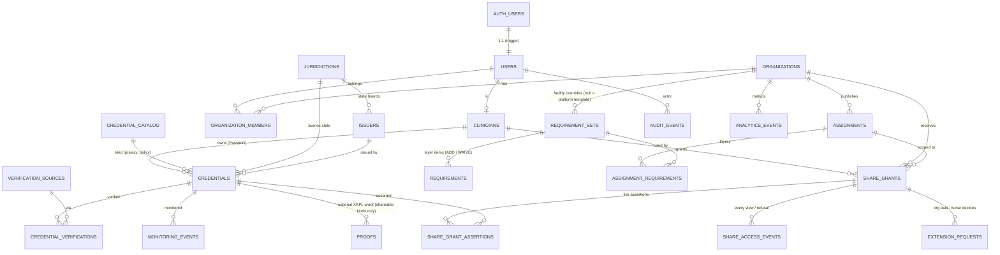

# Veridun backend (Supabase staging)

**Status (PR 10, Oct 8, 2026):** connected. The site has real email sign-in (Supabase Auth magic link). A signed-in clinician's profile, credentials, live shares, extension requests and access events are stored in Munib's **Supabase staging project** (`kiwbasfbiarscalzhopy`, US East), and organizations open shares through the database's share functions. The demo is unchanged and still browser-only.

> **Pre-compliance staging backend: no real PHI yet.** Supabase offers HIPAA support only on a paid plan with a signed BAA (plus their HIPAA project settings). This project has neither. Use test data only. The app shows this notice on the sign-in card and in the account workspace.

| Path | What it is |
|---|---|
| `backend/supabase/migrations/*.sql` | Postgres schema, row-level security (RLS), share-access functions, private storage bucket + policies. **8 migrations, all applied to staging** (PR 12 adds MFA step-up, issuer checks and XRPL anchors; 7–8 are PR 13, applied Oct 9, 2026 through the Management API, see below) |
| `backend/supabase/migrations/20261008000004_accounts_sync.sql` | PR 10: self-serve organizations (`create_organization`), assignment context on grants, `PENDING_VERIFICATION` in share assertions, append-only tables that still allow account deletion |
| `backend/supabase/migrations/20261008000005_specialties_experience.sql` | PR 11: `specialties` reference table (64 RN specialties, read-only to clients), specialty ids validated by trigger, `clinicians.secondary_specialties` (max 5) + `preferences`, `requirements.min_months` / `is_preferred`, `kind` returned by share-assertion functions (for compact-license coverage) |
| `backend/supabase/seed/01_reference.sql` | Jurisdictions (56), issuers, the RN credential catalog (36 kinds), verification sources, platform requirement templates. **Generated from `js/`.** Applied to staging |
| `backend/supabase/migrations/20261009000007_verification_registry.sql` | PR 13: Verification Source Registry columns, seven levels, `credential_catalog` / `requirements` minimum levels with locked floors (trigger), policy columns on `requirement_sets`, `credentials.verification_level` / `monitoring_state` (server-set only), PSV fields on `credential_verifications`, `record_source_check()` |
| `backend/supabase/migrations/20261009000007_verification_registry.sql` (end) | PR 13: `get_share_assertions()` / `access_share_by_token()` also return `verification_level`, `verification_source`, `source_checked_on`, so an organization sees e.g. *Primary Source Verified · Source: California Board of Registered Nursing · checked …* instead of a bare VERIFIED. Level only while currently verified; private (Requirement satisfied) items get the level but never the source or date |
| `backend/supabase/migrations/20261009000008_anchor_grant_hardening.sql` | PR 13 follow-up from the post-apply advisor check: removes Supabase's default `TRUNCATE` (bypasses RLS), `REFERENCES` and `TRIGGER` grants for `anon`/`authenticated` on the two XRPL anchor tables |
| `backend/supabase/seed/03_verification_registry.sql` | PR 13: the 70 registry sources, catalog floors, policy versions, requirement minimum levels. **Generated from `js/`.** Applied to staging |
| `backend/supabase/functions/nursys-enotify/` | PR 13: server-side stub. Returns 503 `configured:false` until NCSBN credentials are set as function secrets. Never returns a made-up result |
| `backend/supabase/seed/02_demo.sql` | Demo data (Alex / Jordan / Sam, 4 fictional agencies, 5 opportunities). Local tests only, **not applied** to staging |
| `backend/scripts/generate-seed.js` | Regenerates both seed files from the app's JS data, so the database can't drift from the demo |
| `backend/supabase/tests/00_local_supabase_shim.sql` | **Test-only** stand-ins for Supabase's `auth`/`storage` schemas and API roles. Never apply to a real project |
| `backend/tests/db-test.js` | Applies migrations + seeds to a throwaway local Postgres; 154 schema / seed / RLS tests (incl. PR 13) |
| `backend/tests/p12.js`, `backend/tests/p13.js` | Live runs in a headless phone browser against staging: create throwaway `veridun-pr12-…` / `veridun-pr13-…@mailinator.com` users in SQL (no email), exercise 2FA, verifier checks, shares and levels, then delete every row they made. Reach the database through `tests/live-db.js` |
| `backend/tests/live-db.js`, `backend/tests/api-db.js` | Database access for the live runs: direct Postgres when `SUPABASE_DB_URL` and port 5432/6543 are reachable, otherwise the Management API with `SUPABASE_ACCESS_TOKEN` (force with `LIVE_DB=api`). `node backend/tests/api-db.js "select 1"` or `@file.sql` runs one query |
| `backend/tests/store-test.js` | 42 unit tests for the data-access layer (mocked supabase-js client, no network) |
| `js/config.js` | Demo: `backend: 'local'`. Accounts: project URL + **publishable** key (public by design; RLS protects data) + redirect URL |
| `js/store.js` | `LocalStorageAdapter` (demo) and `SupabaseAdapter` (accounts: auth, hydrate, writes, RPCs, storage) |
| `js/account.js` | Account UI: sign-in card, My Passport, Shares, Organization, Activity, `?share=` links for account shares |
| `js/vendor/supabase-js-2.117.2.umd.js` | `@supabase/supabase-js` 2.117.2 UMD build (MIT, `supabase-js-LICENSE`), loaded lazily with SRI `sha384-Rj26LVGv…` |

## Architecture

```
Browser (GitHub Pages, static)                          Supabase staging (kiwbasfbiarscalzhopy)
┌────────────────────────────────────┐                  ┌───────────────────────────────────────┐
│ demo views (clinician/org/verifier)│                  │ Auth: email magic link (implicit flow)│
│   └─ store.* ─▶ LocalStorageAdapter│  (never leaves   │ PostgREST /rest/v1 (publishable + JWT)│
│                 (this browser)     │   the browser)   │   └─ RLS on all 22 tables             │
│                                    │                  │ RPCs: create_organization,            │
│ js/account.js (YOUR ACCOUNT)       │   HTTPS,         │   access_share_by_token,              │
│   └─ store.account ─▶ SupabaseAdapter ──────────────▶ │   get_share_assertions,               │
│        in-memory cache only        │   user JWT +     │   revoke_share_grant,                 │
│        supabase-js (lazy, SRI)     │   publishable key│   resolve_extension_request           │
└────────────────────────────────────┘                  │ Storage: private "source-documents"   │
                                                        └───────────────────────────────────────┘
```

- **Two adapters, two kinds of data.** Demo views keep calling the synchronous `store.credentials/events/shares/…` API, backed by `LocalStorageAdapter` with the same keys as before. Account views call `store.account.*` (async) on `SupabaseAdapter`. Demo data is never uploaded, and account data never lands in `localStorage`.
- **Lazy loading.** `supabase-js` is loaded only when you click *Email me a sign-in link*, when a saved session exists (`sb-kiwbasfbiarscalzhopy-auth-token`), when the URL carries a magic-link callback, or when an account share link needs sign-in. The signed-out demo makes **zero** requests to Supabase (checked by `p8`/`p10`).
- **Sign-in:** `signInWithOtp({ email, options: { emailRedirectTo } })`. The redirect is `https://munibabid.github.io/cleartrack-mvp/` on the live site, or the current origin when run locally (Supabase falls back to the Site URL if that origin isn't allow-listed). Implicit flow is used so a link works even if the email app opens it in a different browser on the same phone. The session is stored by supabase-js, and it's the only account item kept in browser storage.
- **Hydrate:** after sign-in, the adapter loads the profile (`clinicians`), memberships, credentials, shares with assertions + org names, extension requests, access events and the activity log (`audit_events`) into memory. Mutations write first and then re-hydrate, so the UI always shows what the database accepted. **Refresh** reloads on demand. Another device picks up changes on sign-in or Refresh.
- **Writes** (all with the user's JWT, all checked by RLS and triggers):
  - credentials are inserted as `VERIFYING`. The database refuses anything else from a client (`credentials_status_guard`).
  - documents are uploaded to `source-documents/<auth.uid()>/<credential id>/<timestamp>-<safe file name>`. The row stores only the path. Viewing uses `createSignedUrl(path, 60)`. Deleting a credential deletes its object.
  - shares: the browser makes a random 128-bit token. It inserts `share_grants` with `token_hash = sha256(token)` plus `share_grant_assertions`. PRIVATE kinds are forced to `REQUIREMENT_SATISFIED`. The link (`…/?share=<token>`) and code are shown **once**.
  - revoke → `revoke_share_grant()`. Approve/decline → `resolve_extension_request()`. A clinician's own extend → `update share_grants` (owner policy). Reactivating a revoked or used grant is refused by trigger.
  - organizations: `create_organization(name)` (security definer). The caller becomes `owner`. Staging limit: 3 per account.
  - org extension request → `insert extension_requests` (`PENDING`). Orgs have no UPDATE on grants.
- **Opening a share (org):** the browser hashes the token, reads the grant's metadata through RLS (only grants to the caller's orgs are visible), then calls `access_share_by_token(token)`. That function checks membership and the live-grant rule, logs `share_access_events` + `audit_events`, consumes one-time grants, and returns sanitized assertions. A refusal comes back as *Revoked / Expired / Already viewed / Not found*.
- **No service keys in the browser.** `validateSupabaseConfig()` rejects `service_role` JWTs, `sb_secret_…` keys and any config carrying a service key. In that case accounts are disabled and the demo is unaffected.

## Entity diagram



Requirement layers map one-to-one to the browser engine: **STATE** (one RN-authorization requirement per jurisdiction) + **WORK_TYPE** base + **SPECIALTY** module (the one matching the nurse's profile specialty, if the assignment accepts it) + **FACILITY** overrides (`ADD` / `WAIVE`) + dates (`assignments.starts_on/ends_on`) + recency (`requirements.recency_months`). `db-test.js` checks that the seeded layers give the same counts as the browser engine: Boston ICU 12, Houston 11, Oakland 10 / 12 / 11 (ICU / ED / L&D), Phoenix ED 13, Denver L&D 12.

## Security model

| Who | Can | Cannot |
|---|---|---|
| **anon** (no sign-in, publishable key only) | read reference data (catalog, jurisdictions, issuers, verification sources) | read any person, credential, grant or event |
| **Clinician** | read/write own clinician row, credentials, share grants + assertions; upload into own storage folder; resolve extension requests on own grants; revoke | change verification status (`VERIFIED`, `REJECTED`, …); edit verified facts (expiry, kind, jurisdiction); start a credential as verified; touch another nurse's data; change own role; re-target or reactivate a revoked grant; share documents (`documents_shared` is constrained to `false`) |
| **Organization member** | read grant *metadata* for grants to **its own org** (incl. `REVOKED` + timestamp, `EXPIRED`); read **assertions only while the grant is live** (ACTIVE, unexpired, unrevoked, one-time not used); request extensions; publish its own assignments / facility override sets | read the `credentials` table; read another org's grants, assertions, members or events; extend its own access; create grants; read source documents |
| **Verifier** (`users.role = 'verifier'`) | read all credentials; update verification state; record verifications and monitoring events; read source documents for manual review | — (roles are assigned server-side only) |
| **Admin** | maintain reference data, organizations | — |

- **The live-grant rule is defined once** (`private.grant_is_live`). It is used both by the RLS policy on `share_grant_assertions` and by `get_share_assertions()`, so expired grants return nothing even before the sweep job has run.
- **No sensitive health detail in assertions:**
  - PRIVATE catalog kinds (health, screening, specialty references) can only be shared as `REQUIREMENT_SATISFIED` (trigger).
  - `get_share_assertions()` returns only a label and "Requirement Satisfied" for them: no name, dates, issuer, results or documents.
  - PRIVATE credentials can't store structured `metadata` (trigger) and can never get an on-chain proof (trigger).
- **Append-only:** `audit_events`, `share_access_events`, `monitoring_events` and `analytics_events` reject `UPDATE`/`DELETE` by trigger, even for the table owner. Clients can't insert `share_access_events` directly; they are written by `get_share_assertions()`, for every view and every refusal.
- **Source documents** go in the private bucket `source-documents`, under the path `<auth.uid()>/<credential-id>/<file>` (10 MB; PDF/PNG/JPEG/DOC/DOCX).
  - Owner: read/write own folder. Verifiers: read only. Organizations: no access.
  - Downloads use short-lived signed URLs created with the user's JWT: `createSignedUrl(path, 60)`.
  - Rows store only the object path.
- **Share tokens:** only `sha256(token)` is stored. Opening a link requires signing in as a member of the grant's org.
- **PR 10 additions:** `create_organization()` is the only way to create an org from the browser (caller becomes owner, max 3). Grants carry an immutable assignment context (`assignment_label`, `assignment_starts_on/ends_on`). `get_share_assertions()` reports credentials no verifier has checked as `PENDING_VERIFICATION`, never `VERIFIED`. A used one-time grant can't be reactivated. Append-only tables still reject `DELETE` and any content change, but allow the `ON DELETE SET NULL` that Postgres performs on their `…_id` columns, so deleting an account no longer fails.

## Running the database tests locally (no Docker, no root)

```bash
# 1. Postgres 17 binaries from npm (any Postgres 15+ works)
mkdir -p /tmp/pgx && cd /tmp/pgx && echo '{}' > package.json
npm i @embedded-postgres/linux-x64@17.10.0-beta.17 pg
P=node_modules/@embedded-postgres/linux-x64/native/bin
node node_modules/@embedded-postgres/linux-x64/scripts/hydrate-symlinks.js; chmod +x $P/*
$P/initdb -D /tmp/pgdata -U postgres --auth=trust -E UTF8
$P/pg_ctl -D /tmp/pgdata -o "-p 54329 -k /tmp" -l /tmp/pg.log start
# 2. Tests (from the repo root)
PGHOST=/tmp PGPORT=54329 PGUSER=postgres NODE_PATH=/tmp/pgx/node_modules node backend/tests/db-test.js
node backend/tests/store-test.js
# Regenerate seeds after changing js/ catalog, requirement or demo data:
node backend/scripts/generate-seed.js
```

`db-test.js` creates and drops a database named `veridun_rls_test`. It loads the test shim, the migrations and both seeds, and also checks that the seeds can be re-run.

## Staging setup: done and left to do

Done (Oct 8, 2026):
1. Supabase project created (US East). Email provider on. Site URL and Redirect URL set to `https://munibabid.github.io/cleartrack-mvp/` (by Munib).
2. Migrations 1–4 and `01_reference.sql` applied and verified (22 tables, RLS on all, private `source-documents` bucket, functions executable only by `authenticated`).
4. Migrations 5–8 and `03_verification_registry.sql` applied and verified (Oct 8–9; 7–8 through the Management API with a scoped token, see PR 13).
3. `js/config.js` carries the project URL and the **publishable** key. The `service_role` / secret key was never requested or used.

Still to do:
- **Email delivery.** Supabase's built-in email sender is meant for testing. It's rate-limited (a few emails per hour per project) and only delivers to your Supabase team's addresses. Before anyone else (a friend, a recruiter) signs in, add custom SMTP (Authentication → Emails → SMTP, e.g. Resend/Postmark/SES) and raise the rate limit.
- **Sign-up policy.** Sign-ups are open (`disable_signup: false`). Turn them off (Authentication → Sign In / Providers) if you want invite-only.
- **Expiry sweep (optional):** enable `pg_cron`, then run
  `select cron.schedule('sweep-expired-grants', '*/15 * * * *', $$select private.sweep_expired_grants()$$);`
  This only updates status labels; access checks never depend on it.
- **Verifier role** (when there's a real verification workflow), server-side only:
  `update public.users set role = 'verifier' where email = '…';`
- **Before any real PHI:** move to a HIPAA-eligible Supabase plan, sign the BAA, enable the HIPAA project settings (SSL enforcement, PITR, network restrictions), complete a risk assessment, and replace the staging notices. Also review audit-log retention and account-deletion policy.

## Cross-device sharing (implemented in PR 10)

1. **Create:** the nurse approves a share in *Your account → Shares*. The browser generates a random token, stores `sha256(token)` with the grant and its assertions, and shows `…/cleartrack-mvp/?share=<token>` and the code once.
2. **Open on another device:** the recruiter opens the link. Signed out, the page asks them to sign in (magic link), and the token waits in `veridun_pending_share_token` until they're back. Signed in, the page calls `access_share_by_token`. Recruiters can also paste the link or code in *Your account → Organization*, or click **View** on any grant listed for their org (`get_share_assertions`).
3. **Revoke / expire:** `revoke_share_grant()` takes effect immediately for every device. Expiry is checked on every read (`expires_at`), with no sweep needed. The org still sees status `REVOKED`/`EXPIRED`/`USED` with timestamps.
4. **Extensions:** the org inserts a `PENDING` request. The nurse sees it on any device and approves or declines (`resolve_extension_request`). Orgs can't update grants.
5. **Later (optional):** Supabase Realtime on `share_grants` / `extension_requests` for instant updates, plus email notifications.

## Tests

| Suite | Where | What |
|---|---|---|
| `db-test.js` | local Postgres 17 + shim | 149 schema / seed / RLS / function tests, incl. migrations 4–7 |
| `p12.js` | headless Chrome, real staging | 2FA + issuer check + XRPL anchor (PR 12) |
| `p13.js` | headless Chrome; staging when reachable | Registry, levels, Why, provenance, golden path, mobile; account PSV route via `record_source_check` (skipped when the database can't be reached) |
| `store-test.js` | Node, mocked supabase-js | 42 adapter tests: config/key validation, lazy client, magic-link redirect, `VERIFYING`-only inserts, private upload paths, signed URLs, hash-only tokens, no localStorage writes, final revocation |
| `p2`–`p6`, `p8` | headless Chrome, signed out | existing demo regressions, unchanged except `p8` §3, which asserted the PR 8 stub's outbox and now asserts that the real adapter stays signed out and sends nothing |
| `p10` | headless Chrome, **real staging project** | 43 signed-in checks with two throwaway users. Covers laptop + phone sync, org creation, share by link/code, honest statuses, isolation (A vs B, org vs credentials/documents, anon), extension request → approval, access events, activity, revoke (final), real-time expiry, one-time use, document delete, sign-out, demo intact. The test users and every row and object they created are deleted afterwards |

The magic-link email round trip can't be automated here (it needs a real inbox). `p10` checks the request (`/auth/v1/otp` with the right `redirect_to`, intercepted so no email is sent) and signs the test users in with passwords through the same adapter.


## PR 12 — authenticator two-factor and XRPL anchors

### Two-factor sign-in (TOTP)

Supabase Auth MFA (`auth.mfa`: enroll, challenge, verify, listFactors, unenroll, getAuthenticatorAssuranceLevel). The user scans a QR code with Google Authenticator, Authy, or 1Password and confirms the first 6-digit code. After each email link, an enrolled user stays at AAL1 until they enter a code. The account does not load credentials, shares, or documents before that.

The database enforces the same rule. `private.mfa_satisfied()` is true when the user has no verified TOTP factor, or the JWT claim `aal` is `aal2`. Restrictive RLS policies require it for:

- reading, adding, changing, or deleting `credentials`
- creating or extending `share_grants` (and inserting assertions)
- reading or writing objects in the private `source-documents` bucket (this is what a 60-second signed URL checks)

Users who have not enrolled keep working. Verifiers must have a verified factor **and** `aal2` before `record_verification()` or any verification-status change. Organization owners and admins need the same before they insert, update, or delete `organization_members` (the first membership, from `create_organization()`, is unchanged).

TOTP is enabled in Supabase by default. No dashboard toggle was required for this project. If a future project has it off: Authentication → Multi-Factor → enable TOTP.

**Recovery:** there are no backup codes and no SMS fallback. If the phone is lost, that person cannot finish sign-in. An admin removes the factor, then they sign in with the email link and enroll again. Do this only after you know it is the account owner.

Dashboard: Authentication → Users → select the user → remove the authenticator factor.

SQL (SQL editor or service role, never the browser key):

```sql
delete from auth.mfa_factors
where user_id = (select id from auth.users where email = 'person@example.com')
  and factor_type = 'totp';
```

### Issuer check

`record_verification(credential, result, source name, reference, date)` is the only supported way to mark an account credential Verified or Failed. `FAILED` is stored as status `REJECTED`. The reference number stays in `credential_verifications.reference_code` and is never part of the ledger commitment. A clinician cannot call it, and a verifier cannot verify a credential on their own clinician profile. Both are enforced in the function and in `credentials_status_guard()`.

The verifier opens the official lookup first. Confirmed public pages (October 2026), also stored on `verification_sources.lookup_url`:

| Source | URL |
|---|---|
| Nursys QuickConfirm (RN licenses) | https://www.nursys.com/LQC/LQCTerms.aspx |
| AHA eCard (BLS, ACLS, PALS). Letter codes: https://www.heart.org/RQIverify | https://ecards.heart.org/student/myecards?pid=ahaecard.employerStudentSearch |
| American Red Cross digital certificate. hStream IDs: https://redcross.healthstream.com/ | https://www.redcross.org/take-a-class/digital-certificate |
| AACN (CCRN, PCCN, CMC, CSC) | https://www.aacn.org/certification/verify-certification |
| BCEN (CEN, CPEN, TCRN, CFRN, CTRN). The nurse requests the verification; there is no open search box. | https://bcen.org/verify-certification/ |
| NCC (RNC-OB, RNC-MNN, RNC-NIC, RNC-LRN, C-EFM) | https://www.nccwebsite.org/verifications/request |

Kinds without one of these pages do not get a made-up URL.

Readiness uses the credential status only. An XRPL anchor never makes a requirement met.

### XRPL anchor

When a check is recorded, the database generates a 32-byte salt and SHA-256s a canonical text of credential id, kind, holder id, result, source name, check date, expiration, and salt. The salt stays in `verification_anchors`. The client anchors **only the 64-character hash**, in an `AccountSet` memo labeled `veridun.verification-anchor.v1`, on XRPL Testnet (Devnet if Testnet's faucet fails). `attach_verification_anchor` stores the transaction hash and ledger index.

**Keys, staging:** each verifier's browser asks the Testnet faucet for a disposable wallet. The seed is kept in that tab's memory and dropped on sign-out. It is not in the repo, not in `js/config.js`, and not in the database.

**Keys, production (not deployed here):** `backend/supabase/functions/anchor-verification` reads `XRPL_SEED` from a function secret and submits the same memo. Mainnet would be the same shape with a key in a KMS or HSM. Each anchor is one transaction; the fee is a fraction of one XRP. This function was not deployed: there is no Supabase access token in this environment.

What Munib would run, from a machine logged into the Supabase CLI:

```bash
supabase login
supabase link --project-ref kiwbasfbiarscalzhopy
supabase secrets set XRPL_SEED='s...'   # a funded account seed, never commit it
supabase functions deploy anchor-verification --project-ref kiwbasfbiarscalzhopy
```

Until that is deployed, the staging site keeps using the in-browser Testnet wallet.

**Check on XRPL:** an organization with a live share calls `share_anchor_disclosure(grant)`. It returns the canonical fields plus the salt for SHAREABLE assertions only, and only while the grant is live. The browser recomputes the hash and reads the transaction from the public Testnet or Devnet endpoint. "Matches ledger" means the memo equals that hash. "Mismatch / altered" means a covered field changed after anchoring. Reference codes, names, and documents are not in the payload or the memo. The proof shows the record has not changed and which address anchored it. It does not prove the issuer check was true.

**Activity log:** `prepare_activity_anchor`, `attach_activity_anchor`, and `check_activity_anchor` fingerprint the account's audit rows through a high-water id. The Activity tab has "Anchor activity log" and "Check log integrity". Newer events are reported as not yet included. The memo type is `veridun.activity-anchor.v1`.

### Setting a verifier

Roles are still server-side only. In the SQL editor:

```sql
update public.users set role = 'verifier' where email = 'person@example.com';
```

Then that person enrolls an authenticator (Security tab) before the Verify tab will record a check.

## PR 13 — verification levels, source registry, policy trace

**Levels** (`private.level_rank`): `CONTINUOUSLY_MONITORED` 6 › `PRIMARY_SOURCE_VERIFIED` 5 › `ISSUER_VERIFIED` 4 › `EMPLOYER_VERIFIED` / `VENDOR_VERIFIED` 3 › `DOCUMENT_REVIEWED` 2 › `SELF_ATTESTED` 1.

**Rules the database enforces:**
- `verification_sources` checks: document review, self-attestation and AI extraction can't grant PSV, AI extraction grants no level, and lookups must be https.
- `requirements` trigger `private.requirements_level_floor`: a facility requirement can't go below a locked catalog floor (licenses PSV, certifications Issuer).
- `credentials.verification_level` and `monitoring_state` can't be set by clients (`private.credentials_level_guard`). A non-VERIFIED credential never has a level. The restrictive policy `verifications_no_client_level` blocks client writes of verification levels.
- `record_source_check(credential, source_slug, result, status_at_source, source_expires_on, reference, checked_on, monitoring)`: verifier role, AAL2, not your own credential. The source must be APPROVED and cover the kind; a board only covers its own state; Nursys covers its participating jurisdictions. Licenses top out at PSV. `ENROLLED` needs an approved monitoring source, which today means none, because e-Notify is pending. VERIFIED ⇔ status ACTIVE, licenses need an expiration, and a failed check maps to REVOKED / EXPIRED / REJECTED. It writes the verification row, the XRPL anchor commitment and an audit event.
- PR 12's `record_verification` free-text path still works: the level comes from a matching approved source name, otherwise Document Reviewed.

**Applied to staging (Oct 9, 2026):** migration 7, `seed/03_verification_registry.sql` and migration 8, through the Management API (below), after a dry run in a rolled-back transaction. Verified afterwards: RLS on all 25 public tables, 70 registry sources (56 approved boards, e-Notify PENDING, AI extraction UNAPPROVED with no level), 7 levels, `record_source_check()` security definer and executable by `authenticated` only (not `anon`), no `anon` EXECUTE on any public function, no `TRUNCATE` for API roles, every security-definer function pins `search_path`. Munib's BLS stayed *Submitted, not verified*.

### Applying migrations without a direct Postgres connection

When ports 5432/6543 are blocked but HTTPS works, apply SQL through the Supabase Management API with a **scoped personal access token**:

1. Supabase → Account → Access Tokens → *Generate new token*: scope **Project** (this project only), **Database: Read & write**, everything else None, shortest expiry (7 days). Keep it in an environment variable (`SUPABASE_ACCESS_TOKEN`); never commit or print it.
2. Each request runs one SQL string:
   ```bash
   curl -sS -X POST "https://api.supabase.com/v1/projects/kiwbasfbiarscalzhopy/database/query" \
     -H "Authorization: Bearer $SUPABASE_ACCESS_TOKEN" -H "Content-Type: application/json" \
     --data "$(jq -Rs '{query: ("begin;\n" + . + "\ncommit;")}' < backend/supabase/migrations/<file>.sql)"
   ```
   A multi-statement string already runs as one implicit transaction; wrapping it in `begin; … commit;` makes that explicit (seed files carry their own). Do a dry run first by ending with `rollback;` instead.
3. Run the post-apply checks above, then `p13.js` / `p12.js` (they use the same token automatically when Postgres is unreachable).
4. Delete the token in Supabase when done.

The frontend detects an un-migrated database and falls back to PR 12 behaviour, so the site keeps working either way.

**Nursys e-Notify:** see `docs/NURSYS-ENOTIFY.md`.

## Known limits

- Account readiness: the demo's assignment-readiness engine, opportunities and dashboards still run on demo data only. Account credentials aren't scored against assignments yet.
- Account credentials stay *Submitted, not verified* until a user with the verifier role records an issuer lookup (PR 12). The staging site does not call issuer APIs; the verifier does the lookup and types the result.
- Changes appear on another open device after **Refresh** (no Realtime yet).
- Built-in Supabase email is rate-limited and only delivers to team addresses (see above).
- Share links/codes are shown once and kept only in memory on the creating device. If one is lost, revoke it and create a new share.
- Not yet a HIPAA environment (see the top of this file).
